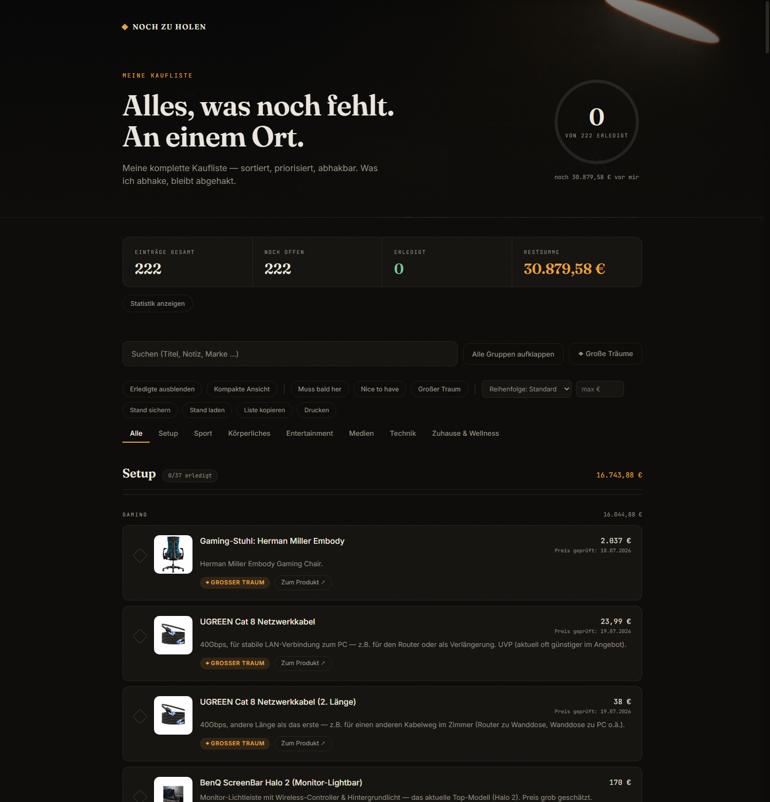

# ◆ Noch zu holen

Meine komplette Kaufliste als Website — über 500 Wünsche in acht Kategorien,
sortiert, priorisiert, abhakbar. Gebaut mit [Claude Code](https://claude.com/claude-code).



## Öffnen

`website/index.html` im Browser öffnen — fertig. Kein Server, kein Build,
keine Installation. Die Ordnerstruktur muss zusammenbleiben, damit die
lokalen Produktbilder aus `assets/` laden.

## Was die Seite kann

- **Abhaken mit Gedächtnis** — Haken werden im Browser (localStorage) gespeichert
  und überleben Neuladen. Fortschrittsring im Hero, Zähler und Balken je Kategorie.
- **Undo** — jeder Haken lässt sich direkt über den Toast rückgängig machen.
- **Filter** — Erledigte ausblenden, nach Priorität filtern (Muss / Nice / Traum),
  nach Preis sortieren, Budget-Grenze setzen („max €").
- **Suche** über Titel, Notizen, Marken und Gruppen (`/` fokussiert die Suche).
- **Produktbilder** — fast alle Einträge bebildert, fast alle lokal gespeichert
  (`assets/images/products/`); Fallback-Kette lokal → remote → Monogramm.
- **Geprüfte Preise** — 446 der 518 Einträge gegen die jeweilige Produktseite abgeglichen
  (Amazon, Herstellershops, Thalia, Geizhals), erkennbar am „Preis geprüft"-Badge.
  Wo kein Preis steht, war auf der Quellseite keiner auslesbar — lieber leer als geraten.
- **Direkte Kauflinks** — Platten, Filme und Serien verlinken auf die konkrete
  Produktseite im richtigen Format (Vinyl bzw. 4K-UHD/Blu-ray), nicht auf eine Suche;
  PC-Bauteile auf die exakte Geizhals-Seite.
- **Gruppen-Abhaken, Statistik-Panel, „Womit anfangen?"-Empfehlung, Abhak-Datum,
  Such-Highlighting, Tab-Link in der URL, Scroll-to-top** — Details siehe Website.
- **Lightbox** mit Blättern (`←`/`→`), Abhaken direkt im Bild.
- **Gruppen** — Hauptprodukt + Zubehör, Alternativen („noch nicht entschieden"),
  Serien-Pakete; einzeln oder alle auf einmal aufklappbar.
- **Große Träume** — Projektansicht, z. B. die Zimmer-Umgestaltung nach Bereichen.
- **Stand sichern / laden** — Abhak-Stand als JSON exportieren und wieder importieren.
- **Drucken** — reduzierte Einkaufsliste (nur offene Einträge) über den Drucken-Button.

## Projektstruktur

```
├── README.md
├── copy/
│   └── brand-kit.md          # Design-Kit: Farben, Typo, Ton, Sektionen
├── assets/
│   ├── images/
│   │   ├── products/         # lokal gespeicherte Produktbilder (nach item.id)
│   │   └── site-preview.png
│   ├── references/           # generierte Hero-/Mood-Referenzbilder
│   └── videos/
└── website/
    └── index.html            # die komplette App — eine Datei, kein Backend
```

## Neuen Wunsch eintragen

`website/index.html` im Editor öffnen und nach `NEUEN WUNSCH EINTRAGEN` suchen —
dort steht eine kommentierte Vorlage zum Kopieren. Kurzfassung: Eintrag mit
einmaliger `id` ins `items`-Array setzen, optional ein Bild in
`assets/images/products/` legen und in der `LOCAL_IMAGES`-Map verlinken.
Speichern, Seite neu laden, fertig.

## Technik

Eine einzige HTML-Datei mit eingebettetem CSS/JS, ohne Framework und ohne Backend.
Datenquelle ist das `items`-Array in `index.html` — Änderungen an der Liste laufen
direkt über diese Datei. Design nach `copy/brand-kit.md`: warmes Fast-Schwarz,
Amber-Akzent, Fraunces / Inter / JetBrains Mono, Filmkorn, Scroll-Reveal —
alles respektiert `prefers-reduced-motion`.
